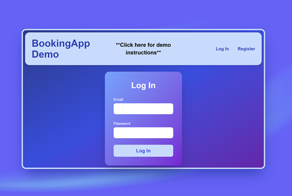
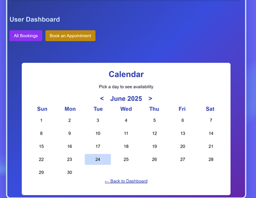

[](https://codecov.io/gh/WarrenPaschetto/fullstack-booking-app)


# Fullstack Booking App

A fullstack scheduling and booking system designed for service-based businesses. I built this project as a capstone project for a backend course I completed with Boot.dev. The frontend I built for the live demo version that currently only demonstarates some of the functionality of the backend. Built with Go, Supabase, and Next.js, this monorepo project allows users to view available time slots, book appointments, and manage their bookings through a sleek and responsive UI.

## 🖼 Live Demo

👉 [**Click here to view the live demo**](https://fullstack-booking-app-hazel.vercel.app/login)

To use app as a regular "user", just register a fake name, fake email, and password. Then log in under that email and password. To experience the app as an "admin", log in with the following:

Email: 
```
admin@example.com
```
Password: 
```
yourPassword123
```

 



> 💡 **Side Note:**  
> There is no method to create a new admin from the frontend—this was intentional.  
> If you really want to create an admin, use a `curl` statement in your terminal as shown in the **Testing Endpoints** section below.


## 🔧 Tech Stack

- **Frontend**: [Next.js](https://nextjs.org/) + [Tailwind CSS](https://tailwindcss.com/)
- **Backend**: [Go](https://golang.org/) (REST API)
- **Database**: [Supabase](https://supabase.com/) (PostgreSQL)
- **CI/CD**: GitHub Actions
- **Testing & Coverage for Backend**: Codecov + Go test suite
- **Monorepo**: Both frontend and backend are in one project

---

## 🚀 Features

- User registration and JWT-based authentication
- Admin and user dashboards
- Provider availability patterns
- User-selectable time slots
- Live calendar with monthly navigation
- Conflict-free appointment creation
- Reschedule and delete functionality
- Clean service-layered Go backend

---

## 🧠 Project Structure

```bash
fullstack-booking-app/
├── backend/            # Go API
│   ├── cmd/            # main.go server entrypoint
│   ├── internal/       # handlers, services, middleware, db
│   └── sql/            # Goose migrations
├── frontend/           # Next.js UI
│   ├── components/     # React components (Calendar, Toolbar, etc)
│   ├── pages/          # Next.js routes
│   └── utils/          # Fetchers and helpers
```

---

## ⚙️ Setup Instructions

## 🛠️ Prerequisites

A fullstack scheduling and booking application built with:

- Go 1.18+ (https://golang.org/dl)
- PostgreSQL (CLI access)
- Goose CLI (https://github.com/pressly/goose)
- A Supabase account (https://supabase.com)


## ⚙️ Setup Supabase

1. Log in to Supabase and create a new project.
2. In the dashboard, go to Settings → Database → Connection string.
3. Copy the Connection string (libpq) URL, for example:
   ```
   postgresql://postgres:<PASSWORD>@db.<project>.supabase.co:5432/postgres?sslmode=require
   ```
4. Clone the repo:
   ```bash
   git clone https://github.com/WarrenPaschetto/fullstack-booking-app.git
   cd fullstack-booking-app/backend
   ```
5. Create `.env` in `/backend`:
   ```env
   DATABASE_URL=postgresql://...    # Your Supabase connection string
   JWT_SECRET=supersecretvalue
   PORT=8080
   ```
6. Install the Goose CLI for managing migrations:

   ```
   # via Go modules
   go install github.com/pressly/goose/v3/cmd/goose@latest

   # or on macOS using Homebrew
   brew install goose
   ```
   Verify installation:
   ```
   goose --version
   ```
7. Run migrations:
   Go into the backend directory:
   ```
   cd backend
   ```
   
   In your shell, export your DATABASE_URL:
   ```
   export DATABASE_URL=postgresql://postgres:<PASSWORD>@db.<project>.supabase.co:5432/postgres?sslmode=require
   ```
   
   Apply migrations:
   ```
   goose -dir sql/schema postgres "$DATABASE_URL" up
   ```

   Verify the created tables:
   ```
   psql "&DATABASE_URL" -c '/dt'
   ```
8. Start the server:
   ```bash
   go mod tidy
   go run ./cmd/main.go
   ```


### Frontend Setup

1. Navigate to the frontend:
   ```bash
   cd ../frontend
   npm install
   ```
2. Create `.env.local`:
   ```env
   NEXT_PUBLIC_API_URL=http://localhost:8080/api
   ```
3. Run the app:
   ```bash
   npm run dev
   ```

---


## 🧪 Testing Endpoints

Open a new terminal and use curl to exercise your handlers:

- **Register a new admin**
  ```
  curl -i -X POST http://localhost:8080/api/register \
  -H "Content-Type: application/json" \
  -d '{"first_name":"Robert","last_name":"Pearl","email":"admin1@example.com","password":"passwordSecret", "user_role":"admin"}'
  ```

- **Register a new user**
  ```
  curl -i -X POST http://localhost:8080/api/register \
  -H "Content-Type: application/json" \
  -d '{"first_name":"John","last_name":"Doe","email":"john@example.com","password":"s3cret"}'
  ```

- **Log in to get a JWT**
  ```
  curl -i -X POST http://localhost:8080/api/login \
  -H "Content-Type: application/json" \
  -d '{"email":"john@example.com","password":"s3cret"}'
  ```

- **Create a booking**
  ```
  TOKEN=<your_jwt_token>
  curl -i -X POST http://localhost:8080/api/bookings/create \
  -H "Content-Type: application/json" \
  -H "Authorization: Bearer $TOKEN" \
  -d '{"appointment_start":"2025-06-01T09:00:00Z","duration_minutes":60}'
  ```

- **Delete a booking**
  ```
  curl -i -X DELETE http://localhost:8080/api/bookings/{id of booking} \
  -H "Authorization: Bearer $TOKEN" 
  ```

- **List bookings for user**
  ```
  curl -i -X GET http://localhost:8080/api/bookings/user \
  -H "Authorization: Bearer $TOKEN" 
  ```

- **Get booking by its id**
  ```
  curl -i -X GET http://localhost:8080/api/bookings/{id of booking} \
  -H "Authorization: Bearer $TOKEN" 
  ```

- **Reschedule a booking**
  ```
  curl -i -X PUT http://localhost:8080/api/bookings/{id of booking} \
  -H "Content-Type: application/json" \
  -H "Authorization: Bearer $TOKEN" \
  -d '{"appointment_start":"2025-06-01T08:00:00Z","duration_minutes":30}'
  ```


---

## 🧼 CI/CD & Testing

- **GitHub Actions**: Auto test and lint on push
- **Codecov**: Monitors backend code coverage

---

## 📜 License

MIT License Feel free to fork and customize for your business use case or play around with!
